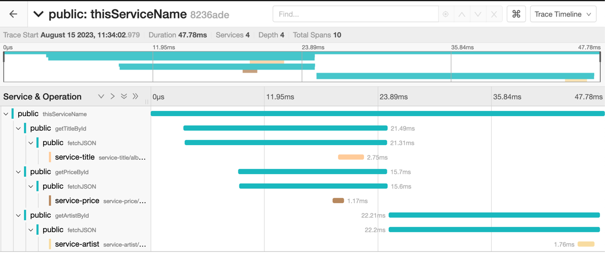

# Jaeger Demo
Jaeger is a distributed tracing system. It is used for monitoring and troubleshooting microservices-based distributed systems. It is compatible with OpenTracing and OpenTelemetry.

This demo demonstrates a system consisting of 4 services that return a list of albums and their details. The services are written in Go and the demo is deployed to a Kubernetes cluster using Helm.

In this example we will use Jaeger with Elasticsearch v7 as the storage backend.

## Getting Started

### Prerequisites

- [Docker](https://docs.docker.com/get-docker/)
- [Kind](https://kind.sigs.k8s.io/docs/user/quick-start/)
- [Helm](https://helm.sh/docs/intro/install/)
- [Kubectl](https://kubernetes.io/docs/tasks/tools/install-kubectl/)
- [Curl](https://curl.se/download.html)
- [Go](https://golang.org/doc/install)

### Prepare The Cluster

#### Cluster Creation

Create a Kubernetes cluster using `kind` with ingress configurations so that we can
access the service locally:

```bash
cat <<EOF | kind create cluster --config=-
kind: Cluster
apiVersion: kind.x-k8s.io/v1alpha4
nodes:
- role: control-plane
  kubeadmConfigPatches:
  - |
    kind: InitConfiguration
    nodeRegistration:
      kubeletExtraArgs:
        node-labels: "ingress-ready=true"
  extraPortMappings:
  - containerPort: 80
    hostPort: 80
    protocol: TCP
  - containerPort: 443
    hostPort: 443
    protocol: TCP
EOF
```

#### Ingress Controller For Accessing Services

Install ingress controller for accessing services in the cluster:

```bash
kubectl apply -f https://raw.githubusercontent.com/kubernetes/ingress-nginx/main/deploy/static/provider/kind/deploy.yaml
```
```bash
kubectl wait --namespace ingress-nginx \
  --for=condition=ready pod \
  --selector=app.kubernetes.io/component=controller \
  --timeout=90s
```
#### Deploying Jaeger with Elasticsearch v7

We will start the Jaeger and Elasticsearch v7 using Helm.

```bash
helm repo add jaegertracing https://jaegertracing.github.io/helm-charts
```

```bash
helm -n default install --wait jaeger jaegertracing/jaeger \
  --set provisionDataStore.cassandra=false \
  --set provisionDataStore.elasticsearch=true \
  --set storage.type=elasticsearch \
  --set elasticsearch.replicas=1 \
  --set elasticsearch.minimumMasterNodes=1 \
  --set collector.service.otlp.grpc.name=otlp \
  --set collector.service.otlp.http.name=otlp-http \
  --set query.ingress.enabled=true \
  --set 'query.ingress.hosts[0]=jaeger-127-0-0-1.nip.io'
```

### Deploy Our Application

By default domain name is `enesonus-127-0-0-1.nip.io`. You can change it by setting `ingress.domain` parameter.
```bash
helm install --wait jaeger-demo oci://ghcr.io/enesonus/jaeger-demo/jaeger-demo --version 0.2.2 \
  --set ingress.domain=enesonus-127-0-0-1.nip.io
```
After this command we will have 4 services running in our cluster. These are:
* Public Service: Returns details of the album with the given id
* Price Service: Returns the price of an album with the given id
* Title Service: Returns the title of an album with the given id
* Artist Service: Returns the artist name of an album with the given id

### Accessing The Application

Now our domain name is `enesonus-127-0-0-1.nip.io`. We can access our application using this domain name.

```bash
curl 'enesonus-127-0-0-1.nip.io/album?id=1'
```
This should return an album (id=1) with title, price and artist name. An example is:

```json
{ 
  "id":"1", 
  "title":"Blue Train",
  "artist":"John Coltrane",
  "price":56.99
}
```
## Query Traces

### Query Traces Using Jaeger UI

We can query traces using Jaeger UI.
Go to http://jaeger-127-0-0-1.nip.io and query traces!
